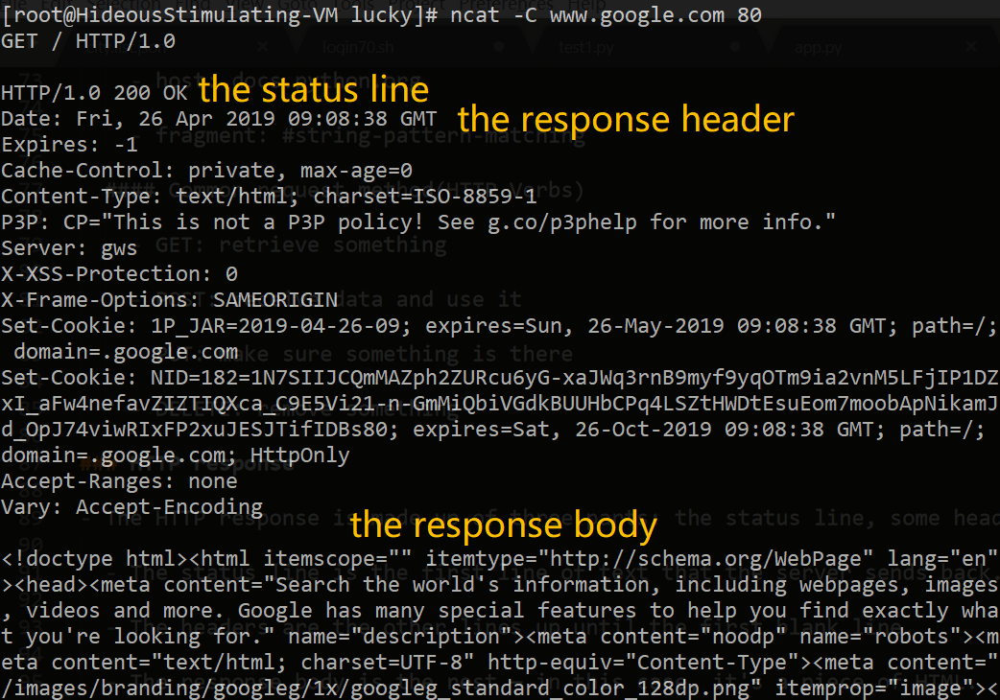

### Web Server

- a piece of software designed to accept incoming web requests

### URI

- A web address is also called a URI for Uniform Resource Identifier. A URI is a name for a resource. URIs are made out of several different parts, each of which has its own syntax. Many of these parts are optional, which is why URIs for different services look so different from one another.

- scheme-hostname(optional):port(optional)-path

  #### Scheme

  - The first part of a URI is the scheme, which tells the client how to go about accessing the resource.

  #### Hostname

  - In an HTTP URI, the next thing that appears after the scheme is a hostname — something like www.udacity.com or localhost. This tells the client which server to connect to.

  - In network terminology, a host is a computer on the network.

  - The Internet tells computers apart by their IP addresses; every piece of network traffic on the Internet is labeled with the IP addresses of the sending and receiving computers. In order to connect to a web server such as www.udacity.com, a client needs to translate the hostname into an IP address. Your operating system's network configuration uses the Domain Name Service (DNS) — a set of servers maintained by Internet Service Providers (ISPs) and other network users — to look up hostnames and get back IP addresses.

  #### Path

  - In an HTTP URI (and many others), the next thing that appears is the path, which identifies a particular resource on a server. A server can have many resources on it — such as different web pages, videos, or APIs. The path tells the server which resource the client is looking for.

  #### Ports

  - All of the network traffic that computers send and receive — everything from web requests, to login sessions, to file sharing — is split up into messages called packets. Each packet has the IP addresses of the computer that sent it, and the computer that receives it. And (with the exception of some low-level packets, such as ping) it also has the port number for the sender and recipient. **IP addresses distinguish computers; port numbers distinguish programs on those computers.**

  #### Relative URI references

    `<a href="cliffsofinsanity.png">cliffsofinsanity.png</a>`

    - URIs like this one don't have a scheme, or a hostname — just a path. This is a relative URI reference. It's "relative" to the context in which it appears — specifically, the page it's on. This URI doesn't include the hostname or port of the server it's on, but the browser can figure that out from context. If you click on one of those links, the browser knows from context that it needs to fetch it from the same server that it got the original page from.

  #### Other URI parts

    - fragment #

      `http://www.example.com/example#pattern`

    - query ?

      `http://www.example.com/example?q=pattern`

### HTTP request

- **HTTP Request** is a packet of Information that one computer sends to another computer to communicate something. To its core, HTTP Request is a packet of binary data sent by the Client to server. An HTTP Request contains three parts: request line, headers and body.

  - Request line: A Request Line specifies the Method Token (GET, PUT … ) followed by the Request URI and then the HTTP Protocol that is being used

  - Headers, 0 or more Headers in the request: Headers are used to pass additional information about the request to the server. In the request section, whatever follows Request Line till before Request Body everything is a Header.

  - An optional Body of the request: Request Body is the part of the HTTP Request where additional content can be sent to the server.

  #### A GET request

    `https://www.google.com/`

    - request line: GET / HTTP/1.1

      - GET: Request method type

      - /: Path

      - HTTP/1.1: protocol and protocol version

    `https://docs.python.org/3/tutorial/stdlib.html#string-pattern-matching`

    - request line: GET /3/tutorial/stdlib.html HTTP/1.0

    - host: docs.python.org

    - fragment: #string-pattern-matching

  #### Common request method(HTTP Verbs)

    - GET: retrieve something

    - POST: receive data and use it

    - PUT: make sure something is there

    - DELETE: remove something

### HTTP response

- The HTTP response is made up of three parts: the status line, some headers, and a response body.

  - The status line is the first line of text that the server sends back.

    - 1xx — Informational. The request is in progress or there's another step to take.
    - 2xx — Success! The request succeeded. The server is sending the data the client asked for.
    - 3xx — Redirection. The server is telling the client a different URI it should redirect to. The headers will usually contain a Location header with the updated URI. Different codes tell the client whether a redirect is permanent or temporary.
    - 4xx — Client error. The server didn't understand the client's request, or can't or won't fill it. Different codes tell the client whether it was a bad URI, a permissions problem, or another sort of error.
    - 5xx — Server error. Something went wrong on the server side.

  - The headers are the other lines up until the first blank line.

    - An HTTP response can include many headers. Each header is a line that starts with a keyword, such as Location or Content-type, followed by a colon and a value. Headers are a sort of metadata for the response. They aren't displayed by browsers or other clients; instead, they tell the client various information about the response.
    - Many, many features of the Web are implemented using headers. For instance, cookies are a Web feature that lets servers store data on the browser, for instance to keep a user logged in. To set a cookie, the server sends the Set-Cookie header. The browser will then send the cookie data back in a Cookie header on subsequent requests.
    - A Content-type header indicates the kind of data that the server is sending. It includes a general category of content as well as the specific format. For instance, a PNG image file will come with the Content-type image/png. If the content is text (including HTML), the server will also tell what encoding it's written in. UTF-8 is a very common choice here, and it's the default for Python text anyway.
    - Very often, the headers will contain more metadata about the response body. For instance, Google sends a Content-Length header, which tells the client how long (in bytes) the response body will be. If the server sends this, then the client can reuse the connection to send another request after it's read the first response. Browsers use this so they can fetch multiple pieces of data (such as images on a web page) without having to reconnect to the server.

  - The response body is the rest — in this case, it's a piece of HTML.

    - The headers end with a blank line. Everything after that blank line is part of the response body. If the request was successful (a 200 OK status, for instance), this is a copy of whatever resource the client asked for — such as a web page, image, or other pieces of data. But in the case of an error, the response body is where the error message goes! If you request a page that doesn't exist, and you get a 404 Not Found error, the actual error message shows up in the response body.

    

### URL quoting
  
  - HTTP URLs aren't allowed to contain spaces or certain other characters. So if you want to send these characters in an HTTP request, they have to be translated into a "URL-safe" or "URL-quoted" format. if that isn't confusing enough, it's sometimes also referred to as **URL-encoding** or **URL-escaping**.

  - One of the features of the URL-quoted format is that spaces are sometimes translated into plus signs. Other special characters are translated into hexadecimal codes that begin with the percent sign.

https://www.toolsqa.com/rest-assured/what-is-rest/

https://www.w3.org/Protocols/rfc2616/rfc2616-sec10.html

https://tools.ietf.org/html/rfc1034

http://web.mit.edu/6.005/www/fa15/classes/21-sockets-networking/
