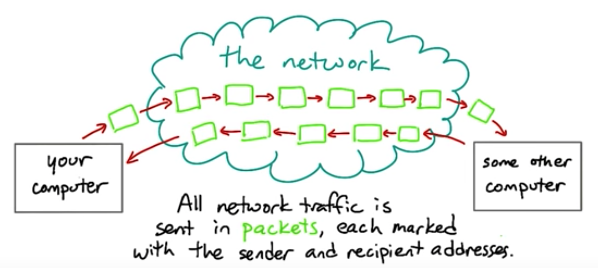
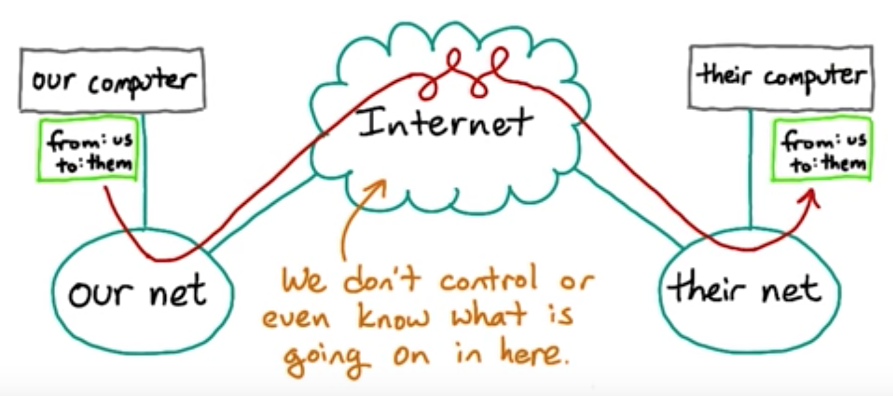
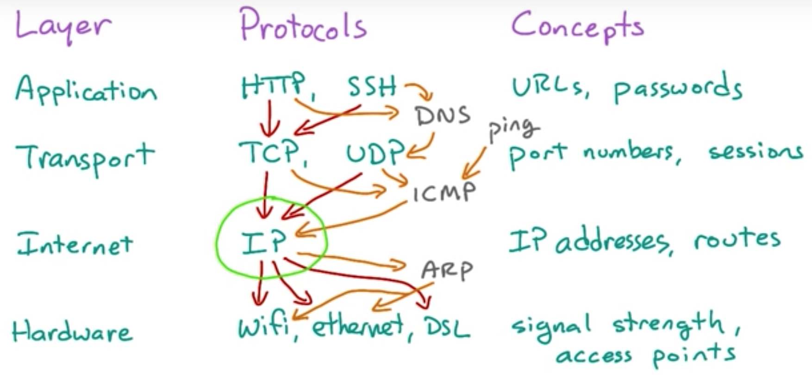
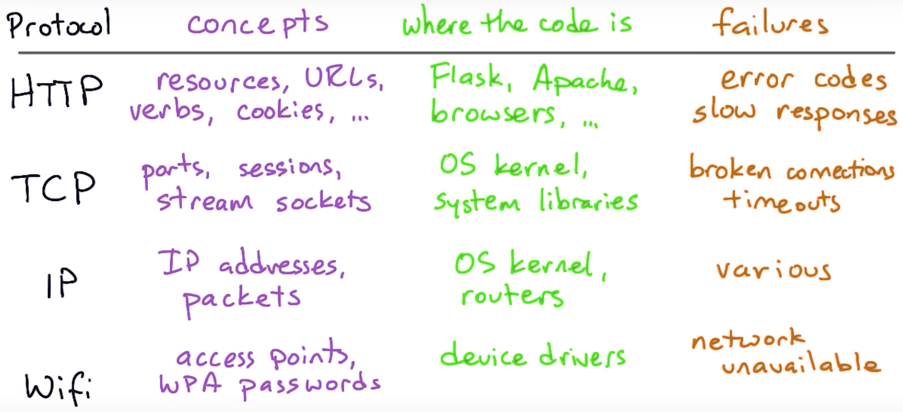

### Network Traffic

&nbsp;

### Names and Addresses

- Hosts: a machine on the internet that might host services.

- Endpoints: the two machines or programs communicating over the connection.

- DNS(Domain Name System): the way that a hostname gets translated into an IP address.

  - The Resolver: the DNS client code built into every operating system. 

  - DNS record types:

    - A(A-Record): IPv4 address record. It is the IPv4 IP address belonging to the hostname of the domain. 
    - AAAA: IPv6 address record. 
    - ANY: all records of all types known to the name server
    - CNAME: Canonical name record. Alias of one name to another: the DNS lookup will continue by retrying the lookup with the new name.
    - MX: Mail exchange record. Maps a domain name to a list of message transfer agents for that domain.
    - NS: Name server record.
    - PTR: Pointer record.
    - SIG: Signature.
    - SOA: Start of authority record.

  - `www.google.com` is the CNAME of the `google.com`. It's pretty much a style and branding preference.

&nbsp;

### IPv4

An IPv4 address is actually a 32-bit numeric value or 4 bytes. We usually write it as a dotted quad — four decimal numbers, separated by dots, like 206.190.36.45 or 180.149.132.47. Each of the four numbers written down like this represents one octet or 8-bit value.
However, not all of the possible 32-bit values are used for real addresses. Some of them are used for special applications that use addresses differently. Some of them are reserved for internal private networks. Some of them are for testing or documentation.

- The light-green squares (0, 10, and 127) are blocks that are entirely reserved.
- The dark-green squares are blocks that are partly reserved. For instance, not all of the 192 block is reserved, but some of it is.
- The entire cyan row (starting at 224) is set aside for IP multicast.
- And the entire orange bottom row (starting at 240) was originally set aside for "future use" but was effectively lost due to being blocked as invalid. No, really. We lost 1/16th of all IPv4 addresses due to mistaken planning.
217.201.63.95
1 byte or 8 bits(8 bits in a byte)
0 ~ 255

netblocks and subnets
/24 netblocks
/22 netblocks
subnet masks 
1111 1111 1111 1111 0000(255.255.255.0)
1111 1111 1111 1100 0000(255.255.252.0)

private address netblocks:
10.0.0.0/8
172.16.0.0/12
192.168.0.0/16

&nbsp;

### The Internet Protocol Stack

