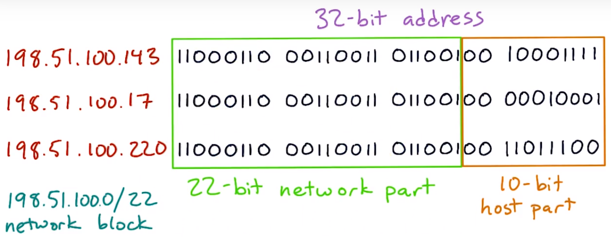

### Network Traffic


&nbsp;

### Names and Addresses

- Hosts: a machine on the internet that might host services.

- Endpoints: the two machines or programs communicating over the connection.

- DNS(Domain Name System): the way that a hostname gets translated into an IP address.

  - The Resolver: the DNS client code built into every operating system.

  - DNS record types:

  > A(A-Record): IPv4 address record. It is the IPv4 IP address belonging to the hostname of the domain.
  >
  > AAAA: IPv6 address record.
  >
  > ANY: all records of all types known to the name server
  >
  > CNAME: Canonical name record. Alias of one name to another: the DNS lookup will continue by retrying the lookup with the new name.
  >
  > MX: Mail exchange record. Maps a domain name to a list of message transfer agents for that domain.
  >
  > NS: Name server record.
  >
  > PTR: Pointer record.
  >
  > SIG: Signature.
  >
  > SOA: Start of authority record.

  - `www.google.com` is the CNAME of the `google.com`. It's pretty much a style and branding preference.

&nbsp;

### IPv4


 - 1 byte or 8 bits(8 bits in a byte)
 - 0 ~ 255(2^8)

An IPv4 address is actually a 32-bit numeric value or 4 bytes. We usually write it as a dotted quad — four decimal numbers, separated by dots, like 206.190.36.45 or 180.149.132.47. Each of the four numbers written down like this represents one octet or 8-bit value.
However, not all of the possible 32-bit values are used for real addresses. Some of them are used for special applications that use addresses differently. Some of them are reserved for internal private networks. Some of them are for testing or documentation.


 - The light-green squares (0, 10, and 127) are blocks that are entirely reserved.
 - The dark-green squares are blocks that are partly reserved. For instance, not all of the 192 block is reserved, but some of it is.
 - The entire cyan row (starting at 224) is set aside for IP multicast.
 - And the entire orange bottom row (starting at 240) was originally set aside for "future use" but was effectively lost due to being blocked as invalid. No, really. We lost 1/16th of all IPv4 addresses due to mistaken planning.

&nbsp;

### Netblocks and Subnets


/24 netblocks


/22 netblocks

- subnet masks
  - 1111 1111 1111 1111 0000(255.255.255.0)
  - 1111 1111 1111 1100 0000(255.255.252.0)

- private address netblocks
  - 10.0.0.0/8
  - 172.16.0.0/12
  - 192.168.0.0/16

&nbsp;

### The Internet Protocol Stack


- Connection Establishment


- TCP flags

  `22:02:54.723421 IP 93.184.216.34.80 > 192.168.1.101.49365: Flags [S.], seq 4022969080, ack 3736858665, win 65535, options [mss 1448,sackOK,TS val 3338386426 ecr 2311164443,nop,wscale 9], length 0`

  - Each TCP packet record that we look at in tcpdump has a section called Flags that appears right after the address and port information. It has one or more letters or dots inside square brackets. +Take a look at the tcpdump data again. We'll see different packets having flags such as `[S]`, `[S.]`, `[.]`, `[P.]`, and `[F.]`. The Flags field in tcpdump tells us which flags, or control bits, are set on each TCP packet.

  - In low-level computer languages, a **flag** is a Boolean value — a true or false value — that is stored in memory as a single bit. If a flag bit is 1, we say the flag is set. If the flag bit is 0, the flag is cleared (or unset). Usually, flags come in groups, each of which can be set or cleared.

  - The original TCP packet format has six flags. Two more optional flags have since been standardized, but they are much less important to the basic functioning of TCP. For each packet, **tcpdump** will show you which flags are set on that packet.

  > SYN(synchronize)`[S]` — This packet is opening a new TCP session and contains a new initial sequence number.
  >
  > FIN(finish)`[F]` — This packet is used to close a TCP session normally. The sender is saying that they are finished sending, but they can still receive data from the other endpoint.
  >
  > PSH(push)`[P]` — This packet is the end of a chunk of application data, such as an HTTP request.
  >
  > RST(reset)`[R]` — This packet is a TCP error message; the sender has a problem and wants to reset (abandon) the session.
  >
  > ACK(acknowledge)`[.]` — This packet acknowledges that its sender has received data from the other endpoint. *Almost every packet except the first SYN will have the ACK flag set*.
  >
  > URG(urgent)`[U]` — This packet contains data that needs to be delivered to the application out-of-order. Not used in HTTP or most other current applications.

  ```
  14:39:31.899348 IP 192.168.1.101.54298 > 182.61.200.6.80: Flags [S], seq 1268802434, win 65535, options [mss 1460,nop,wscale 5,nop,nop,TS val 2319976256 ecr 0,sackOK,eol], length 0
  14:39:31.953174 IP 182.61.200.6.80 > 192.168.1.101.54298: Flags [S.], seq 1280447699, ack 1268802435, win 8192, options [mss 1448,nop,wscale 5,nop,nop,nop,nop,nop,nop,nop,nop,nop,nop,nop,nop,sackOK,eol], length 0
  14:39:31.953225 IP 192.168.1.101.54298 > 182.61.200.6.80: Flags [.], ack 1, win 8192, length 0
  14:39:31.953376 IP 192.168.1.101.54298 > 182.61.200.6.80: Flags [P.], seq 1:40, ack 1, win 8192, length 39: HTTP: GET / HTTP/1.1
  14:39:31.953426 IP 192.168.1.101.54298 > 182.61.200.6.80: Flags [F.], seq 40, ack 1, win 8192, length 0
  14:39:32.007674 IP 182.61.200.6.80 > 192.168.1.101.54298: Flags [.], ack 41, win 916, length 0
  14:39:32.007677 IP 182.61.200.6.80 > 192.168.1.101.54298: Flags [.], ack 40, win 916, length 0
  14:39:32.007679 IP 182.61.200.6.80 > 192.168.1.101.54298: Flags [.], seq 1:1441, ack 41, win 916, length 1440: HTTP: HTTP/1.1 200 OK
  14:39:32.010622 IP 182.61.200.6.80 > 192.168.1.101.54298: Flags [.], seq 1441:2881, ack 41, win 916, length 1440: HTTP
  14:39:32.010661 IP 192.168.1.101.54298 > 182.61.200.6.80: Flags [.], ack 2881, win 8147, length 0
  14:39:32.010782 IP 182.61.200.6.80 > 192.168.1.101.54298: Flags [P.], seq 2881:4097, ack 41, win 916, length 1216: HTTP
  14:39:32.010784 IP 182.61.200.6.80 > 192.168.1.101.54298: Flags [.], seq 4097:5537, ack 41, win 916, length 1440: HTTP
  14:39:32.010801 IP 192.168.1.101.54298 > 182.61.200.6.80: Flags [.], ack 4097, win 8154, length 0
  14:39:32.010920 IP 182.61.200.6.80 > 192.168.1.101.54298: Flags [.], seq 5537:6977, ack 41, win 916, length 1440: HTTP
  14:39:32.010923 IP 182.61.200.6.80 > 192.168.1.101.54298: Flags [.], seq 6977:8417, ack 41, win 916, length 1440: HTTP
  14:39:32.010942 IP 192.168.1.101.54298 > 182.61.200.6.80: Flags [.], ack 6977, win 8147, length 0
  14:39:32.011162 IP 182.61.200.6.80 > 192.168.1.101.54298: Flags [.], seq 8417:9857, ack 41, win 916, length 1440: HTTP
  14:39:32.011165 IP 182.61.200.6.80 > 192.168.1.101.54298: Flags [.], seq 9857:11297, ack 41, win 916, length 1440: HTTP
  14:39:32.011167 IP 182.61.200.6.80 > 192.168.1.101.54298: Flags [.], seq 11297:12737, ack 41, win 916, length 1440: HTTP
  14:39:32.011185 IP 192.168.1.101.54298 > 182.61.200.6.80: Flags [.], ack 9857, win 8057, length 0
  14:39:32.011202 IP 192.168.1.101.54298 > 182.61.200.6.80: Flags [.], ack 12737, win 7967, length 0
  14:39:32.011206 IP 182.61.200.6.80 > 192.168.1.101.54298: Flags [.], seq 12737:14177, ack 41, win 916, length 1440: HTTP
  14:39:32.011421 IP 182.61.200.6.80 > 192.168.1.101.54298: Flags [P.], seq 14177:15389, ack 41, win 916, length 1212: HTTP
  14:39:32.011452 IP 192.168.1.101.54298 > 182.61.200.6.80: Flags [.], ack 14177, win 8018, length 0
  14:39:32.011464 IP 182.61.200.6.80 > 192.168.1.101.54298: Flags [F.], seq 15389, ack 41, win 916, length 0
  14:39:32.011476 IP 192.168.1.101.54298 > 182.61.200.6.80: Flags [.], ack 15389, win 7980, length 0
  14:39:32.011504 IP 192.168.1.101.54298 > 182.61.200.6.80: Flags [.], ack 15390, win 7980, length 0
  14:39:32.011579 IP 192.168.1.101.54298 > 182.61.200.6.80: Flags [.], ack 15390, win 8076, length 0
  14:39:32.011681 IP 192.168.1.101.54298 > 182.61.200.6.80: Flags [.], ack 15390, win 8172, length 0
  14:39:32.063030 IP 182.61.200.6.80 > 192.168.1.101.54298: Flags [R], seq 1280450580, win 0, length 0
  14:39:32.065151 IP 182.61.200.6.80 > 192.168.1.101.54298: Flags [R], seq 1280463089, win 0, length 0
  ```

- Three-way handshake

  The first packet sent to initiate a TCP session always has the SYN flag set. This *initial SYN* packet is what a client sends to a server to start opening a TCP connection. This is the first packet you see in the sample tcpdump data, with `Flags [S]`. This packet also contains a new, randomized sequence number (seq in tcpdump output).

  If the server accepts the connection, it sends a packet back that has the SYN and ACK flags, and acknowledges the initial SYN. This is the second packet in the sample data, with `Flags [S.]`. This contains a different initial sequence number. (If the server doesn't want to accept the connection, it may not send anything at all. Or it may send a packet with the RST flag.)

  Finally, the client acknowledges receiving the SYN|ACK packet by sending an ACK packet of its own.

  **This exchange of three packets is usually called the TCP three-way handshake**. In addition to sequence numbers, the two endpoints also exchange other information used to set up the connection.

- Four-way teardown

  When either endpoint is done sending data into the connection, it can send a FIN packet to indicate that it is finished. The other endpoint will send an ACK to indicate that it has received the FIN.

  In the example HTTP data, the client sends its FIN first, as soon as it is done sending the HTTP request. This is the first packet containing `Flags [F.]`.

  Eventually the other endpoint will be done sending as well, and will send a FIN of its own. Then the first endpoint will send an ACK.

- In between

  In a long-running connection, there will be many packets exchanged back and forth. Some of them will contain application data; others may be only acknowledgments with no data (`length 0`). However, all TCP packets in a connection except the initial SYN will contain an acknowledgment of all the data that the sender has received so far. Therefore, they will all have the ACK flag set. (This is why tcpdump depicts the ACK flag with just a dot: it's really common.)

- ICMP and UDP don't have TCP flags

  If we look at tcpdump data for pings or basic DNS lookups, we will not see flags. This is because ping uses ICMP, and basic DNS lookups use UDP. These protocols do not have TCP flags or sequence numbers.

- TCP congestion control

  If packets are dropped, it slows down, and then gradually it speed up again. Routers work with this by dropping packets if the link they're trying to send on is too busy. If the router just let everything queue up, the whole connection would eventually time out. This is called TCP congestion contrl. It's one of the most important performance features of TCP.
  
  

- TTL(time to live)

  
  Every packet has a time to live or TTL field, which starts at some large number and is reduced by one each time that packet hits a router. As it moves through the network, each router reduces the TTL on the packet by one as it passes it on, all the way until it finally gets to its destination.

  
  This helps keep momentary loops from crashing large parts of the network with an overload of traffic. When a packet's TTL is 0, it means the TTL is expired. When a packet's TTL expires, the router that last received it, sends a tiny error message back to the packet's original sender.

- Network speed

  Bandwidth and latency are the two networky things that people often mean when they refer to speed of a network connection.

  > bandwidth in bits/second
  >
  > delay or latency in seconds

  > bandwidth-delay product: the amount of data that can be in transit through a connection. bits/seconds\*seconds = bits

&nbsp;

### Middleboxes

- Firewalls

  **Firewalls** are devices that network operators can use to filter traffic that's coming into or leaving their network. A firewall is one example of a class of network devices called **middleboxes** — devices that inspect, modify, or filter network traffic. Other examples of middleboxes include **intrusion detection systems** and **load balancers**. Technically, *it's only a middle-box if it's a separate device from the client or server* — server-side "firewalls" like Linux iptables aren't middleboxes.

  A firewall can be a real boon to an organization's network security. The most common configuration for a firewall is to **drop any incoming traffic except traffic to (host, port) pairs that are supposed to be receiving connections from the Internet**. This lets the network administrator be sure that other machines on the network — like backend databases or administrative systems — aren’t going to get direct attacks from outside.

  But firewalls can cause trouble for application developers. If you're trying to test or deploy a network app and there's a firewall between your server and the user, that firewall can potentially interfere with your app or block it completely. In order to deploy an application on a particular server and port, it helps to know what kind of firewall might be between you and your user. One of the reasons that many non-Web applications use HTTP as a transport is that HTTP is often unblocked at firewalls even when other ports are blocked.

- Filtering

  Aside from blocking traffic outright, middleboxes can also **alter traffic**, for instance replacing web pages with error messages. This is often done for social or political purposes. For instance, in the U.S., many schools use **traffic filters** of various sorts to prevent students from accessing web sites deemed inappropriate for children. But what sites get counted as "inappropriate" can reflect the biases or opinions of the people who wrote or configured the filter.

  And people who program these things can always make mistakes, too. For instance, there's [a whole class of bugs](https://www.telegraph.co.uk/news/newstopics/howaboutthat/2667634/The-Clbuttic-Mistake-When-obscenity-filters-go-wrong.html) that arise from filters that try to block rude words, but end up blocking or replacing innocuous words that contain a rude word as a substring.

  Rather famously, some countries have deployed large-scale firewalls or filters to censor their citizens' access to the global Internet. Major well-known sites such as YouTube and Twitter are sometimes blocked entirely in some countries. That can happen to your site, too — just something to keep in mind.

- NAT

  NAT is short for **Network Address Translation**. With NAT, several devices can access Internet resources through a single public IP address, with the NAT device using port numbers to match up connections on the inside and outside.

  For end-users, NAT devices overlap with firewalls. Typical home routers can act as both a NAT and a simple firewall, often having the ability to block or filter at a very basic level. At a larger scale, ISPs and other organizations have deployed NAT devices for their whole customer networks, called [carrier-grade NAT](https://en.wikipedia.org/wiki/Carrier-grade_NAT). This is very common for mobile networks, and also for ISPs in the developing world, where there never were anywhere near enough addresses allocated for the number of users.

  Usually we imagine an end-user computer as having only one person using it at a time. After all, there's generally only one mouse and keyboard. Two people typing on the same keyboard at the same time doesn't generally happen outside of poorly thought-out TV shows. But in the case of NAT, your web site can see requests from the same IP address that actually come from different users on different computers.

- Proxies

  Whereas a NAT works at the IP level, rewriting packets, a **web proxy** works at the HTTP level, taking queries from browsers and sending them out to web servers. Many organizations use web proxies for caching, including some ISPs. From the standpoint of a web developer or site operator, traffic from a busy proxy looks much the same as traffic from a busy NAT: queries for many users, on many actual computers, are funneled through a single public IP address.


